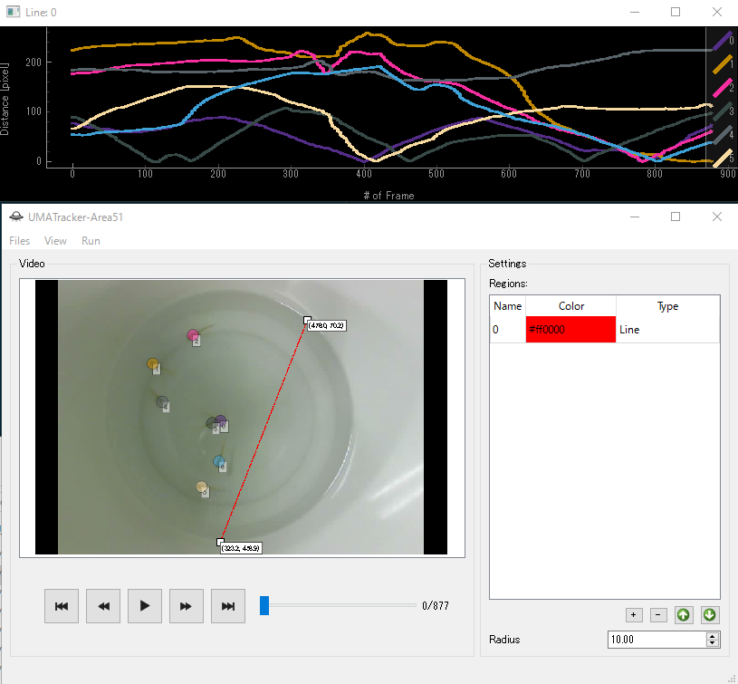

# UMATracker

## Detail
See [Top Page](http://ymnk13.github.io/UMATracker/).

## Donwload
See [GitHub Releases Page](https://github.com/UMATracker/UMATracker/releases).

## Change Log

### 2018/03/18

#### Tracking

* 手動トラッキングで失敗したときに，失敗したフレームからリスタートできるようになった
* トラッキング開始時に真っ黒なフレームを無視するようにした
    これによってビデオを事前に編集する必要がなくなった
* トラッキング途中に発生するトラッキングエラーを無視するオプションを追加した

### 2018/03/04

#### Tracking

* 手動トラッキング機能（Pochi-Pochi Tracking）追加

#### Area51

* Objectのセーブ・ロード機能を追加

#### Area51/TrackingCorrector

* フレーム番号が0から始まらないデータの読み込みに失敗するバグを修正

### 2017/08/09

#### Tracking

* 現在のスライダーバーの位置までしか正しくセーブされないバグを修正

### 2017/03/26

#### Area51

* 細かいバグの修正．

### 2017/03/24

* スライダをマウスでドラッグアンドドロップしたとき，指定した間隔通りに動かない問題を修正．

### 2017/03/23

#### FilterGenerator

* PolySelectorブロックにおいて任意の多角形をサポート．
* Binalizeせずフィルタをセーブしようとすると警告が出るようになった．

### 2017/03/14

#### Area51

* オブジェクト・コンボボックスの変更が，ビューへ即時反映されるよう変更．

### 2016/12/03

#### Tracking

#### TrackingCorrector

#### Area51

* FrameDeltaを指定して得られたデータを扱うときに正しく動作しない問題を修正．

#### Area51

* ROI DiagramにAxis Labelを表示するようにした．

### 2016/11/16

#### Tracking

#### TrackingCorrector

* マウススクロールでビデオプレイバックスライダーがスクロールされるようになった．

### 2016/11/08

#### FilterGenerator
* カラーパレットとゴミ箱がオフラインでも表示されるように修正した．

### 2016/06/29
* UI修正．

#### FilterGenerator
* 背景生成時，何フレーム使用するのかを表示するようになった．

#### Tracking
* 再推定に失敗するバグを修正．

#### Area51
* 任意の直線と各個体間の距離を算出できるようになった．

### 2016/06/26

#### FilterGenerator
* ビデオ出力機能のバグ修正（Windows版）．

#### Tracking
* SkeletonEstimatorの精度向上（Windows 64bit版）．

#### Area51
* 点・領域の座標を表示．
